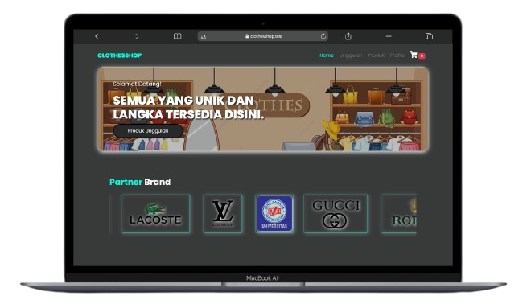
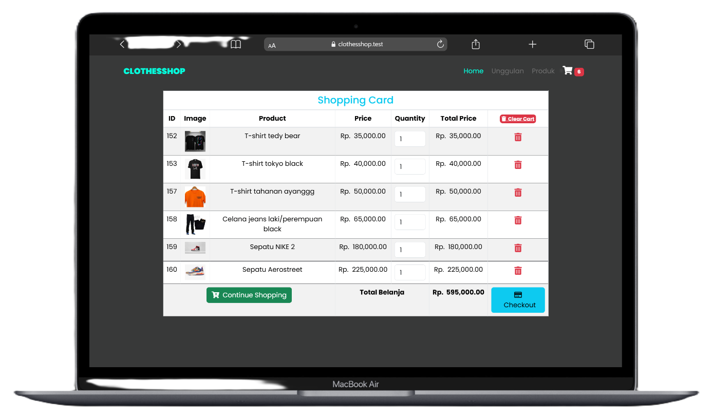

# 🌐 Tugas Project Semester 3

Aplikasi web toko / e-commerce sederhana yang dibuat menggunakan **PHP, MySQL, HTML, CSS, dan JavaScript**.  
Proyek ini dikembangkan sebagai bagian dari tugas project semester 3.

---

## 📚 Table of Contents
- [Screenshots / Demo](#-screenshots--demo)
- [Tentang Proyek](#-tentang-proyek)
- [Fitur](#-fitur)
- [Struktur Folder](#-struktur-folder)
- [Teknologi yang Digunakan](#-teknologi-yang-digunakan)
- [Instalasi & Setup](#-instalasi--setup)
- [Penulis](#-penulis)

---

## 📸 Screenshots / Demo
<p align="center">
  
  
  
  
</p>

---

## 📘 Tentang Proyek
Proyek ini bertujuan untuk membuat sistem toko online sederhana dengan fitur dasar:
- Menampilkan daftar produk
- Menambahkan produk ke keranjang
- Melakukan checkout
- Konfigurasi database untuk menyimpan data produk dan transaksi

---

## ✨ Fitur
- 🛍️ Menampilkan daftar produk dari database  
- 🛒 Keranjang belanja (add, remove item)  
- 💳 Checkout pesanan  
- ⚙️ Konfigurasi database di `config.php`  
- 🎨 Tampilan front-end menggunakan CSS  
- ⚡ Interaksi dinamis dengan JavaScript  

---

## 📁 Struktur Folder
```
/
├── css/ # File CSS untuk styling
├── image/ # Gambar / aset
├── js/ # File JavaScript
├── index.php # Halaman utama
├── allproduk.php # Menampilkan semua produk
├── cart.php # Halaman keranjang
├── checkout.php # Halaman checkout
├── action.php # Aksi untuk tambah / hapus keranjang
└── config.php # Konfigurasi database
```

---

## 🛠️ Teknologi yang Digunakan
- **PHP** (Back-end)
- **MySQL** (Database)
- **HTML5** (Markup)
- **CSS3** (Styling)
- **JavaScript** (Interaktivitas)
- **Laragon** (Server lokal)

---

## ⚙️ Instalasi & Setup
1. Clone repository ini:
   ```bash
   git clone https://github.com/IrsyadHaniff/tugasProject-smt3.git
   cd tugasProject-smt3
2. Jalankan server lokal (XAMPP/WAMP/Laragon).
   Pastikan Apache dan MySQL aktif.
3. Buat database baru di phpMyAdmin (contoh: db_tugasproject).
4. Jika ada file .sql, impor ke database.
5. Sesuaikan file config.php:
    ```
    <?php
    $db_host = "localhost";
    $db_user = "root";
    $db_pass = "";
    $db_name = "db_tugasproject";
    ?>
    ```

---

## 👤 Penulis
- **Nama**: Irsyad Hanif Munawar  
- **GitHub**: [@IrsyadHaniff](https://github.com/IrsyadHaniff)  
- 📅 2025